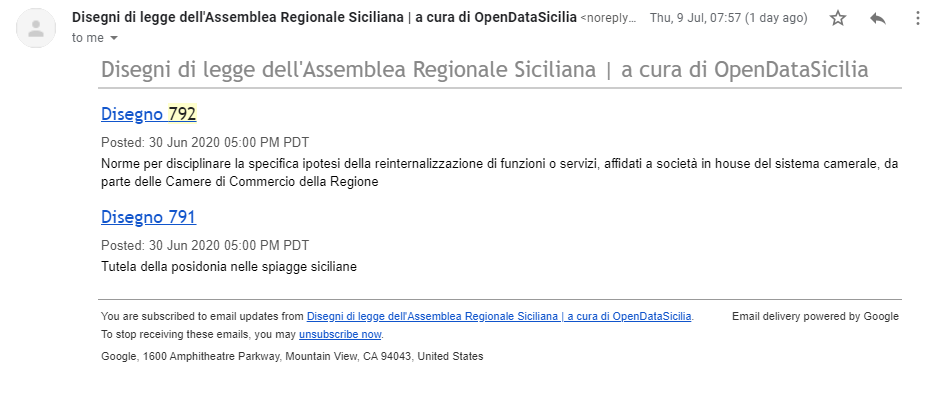

## Essere avvisati per nuove proposte di Disegni di Legge dell'Assemblea Regionale Siciliana (ARS) e per delibere e leggi approvate

L'**Assemblea Regionale Siciliana** (ARS) dal 1947 è l'**organo legislativo** della **Regione siciliana**, come previsto dal suo statuto speciale (da Wikipedia). 
Al momento l'unico modo per seguirne le attività è aprire le pagine dei siti internet ufficiali.

Abbiamo creato allora dei **meccanismi automatici** per essere **avvisati** su:

- **nuove proposte di Disegni di Legge**;
- **delibere e leggi approvate**.

Tre modi:

  - [📧 Posta elettronica](#-posta-elettronica)
  - [📰 Lettore di feed RSS](#-lettore-di-feed-rss)
  - [💬 Canale Telegram](#-canale-telegram)

### 📧 Posta elettronica

Questo è il **metodo più semplice**.
 Basta aprire la **pagina di iscrizione**, 1) inserire il proprio **indirizzo email**, 2) fare click sulla verifica di non essere un *robot* e 3) poi sul pulsante di iscrizione.

Pagine di iscrizione:

- **nuove proposte di Disegni di Legge** <https://feedburner.google.com/fb/a/mailverify?uri=ars_disegni_legge&amp;loc=en_US>;
- **delibere e leggi approvate** <https://feedburner.google.com/fb/a/mailverify?uri=RegioneSicilianaDelibereEDisegniDiLeggeDelGoverno&loc=en_US>

Chi si iscriverà in questo modo, riceverà un'email per confermare la scelta.

Una volta iscritti si riceverà un'email periodica, con l'elenco degli ultimi Disegni di Legge presentati e/o delibere e leggi approvate.

Sotto un esempio.

### 📰 Lettore di feed RSS

L'output principale di questo lavoro sono dei *feed RSS* e per leggerli si può usare un lettore dedicato. Una volta installato, non rimarrà che aggiungere l'URL del *feed* che si vuole seguire:

- **nuove proposte di Disegni di Legge** <http://feeds.feedburner.com/ars_disegni_legge>;
- **delibere e leggi approvate** <http://feeds.feedburner.com/RegioneSicilianaDelibereEDisegniDiLeggeDelGoverno>.

Alcuni lettori di *feed RSS*, installabili su *smartphone* e/o usabili da PC:

- feedly <https://feedly.com/>;
- Inoreader <https://www.inoreader.com/>;
- Tiny Tiny RSS <https://tt-rss.org/>.

Una volta aggiunti, le varie proposte di Disegno Di Legge e/o delibere e leggi approvate, appariranno nel proprio lettore (sotto un esempio).

### 💬 Canale Telegram

Per chi usa [**Telegram**](https://telegram.org/) è stato creato un canale, dove saranno pubblicate le proposte di Disegno Di Legge e le delibere e leggi approvate.

Per iscriversi al canale fare click qui <https://t.me/ars_unofficial> e una volta aperto fare click su <kbd>UNISCITI</kbd>.

**Nota bene**: non funziona ancora al meglio, qualche disegno non viene tracciato. Via email o via feed RSS al momento non si riscontra alcun problema.

## Note

### Nuove proposte di Disegni di Legge

Il sito dedicato ai **disegni di legge** che vengono prensentati all'interno dell'**ARS** è <https://www.ars.sicilia.it/ms/home/cerca/221.jsp>. Sottiliniamo il fatto che **si tratta di proposte**.

Molto spesso quando si aprirà l'URL della proposta di Disegno di Legge, la pagina conterrà pochissime informazioni. Questo avviene perché sembra che quando una proposta viene inserita nel sistema non è corredata da alcun documento.

### Delibere e leggi approvate

Il sito dedicato a **delibere e leggi approvate** è <http://www.regione.sicilia.it/deliberegiunta/index.asp>.
