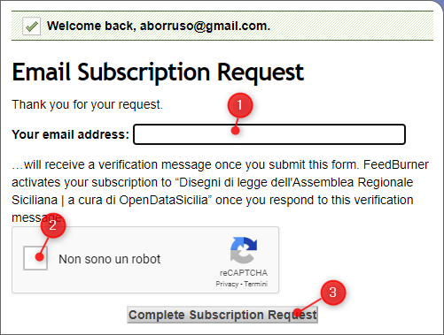
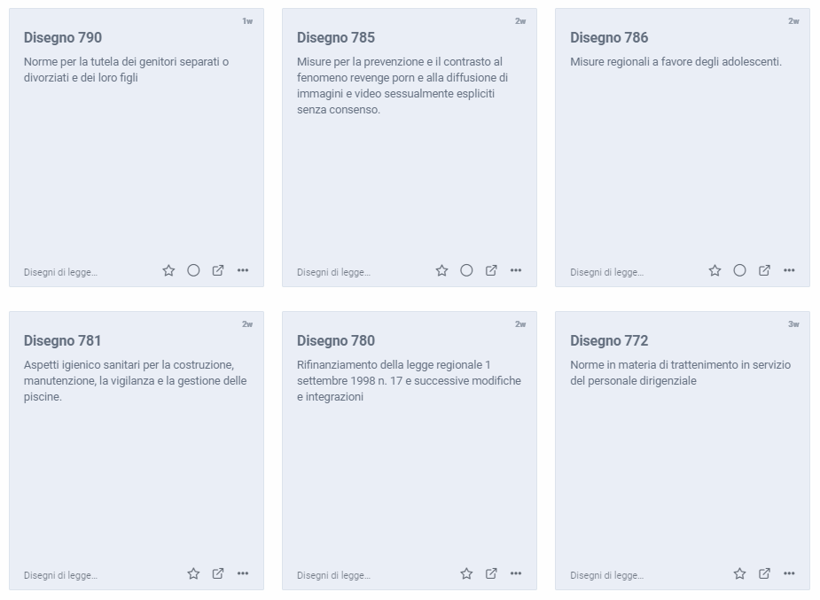
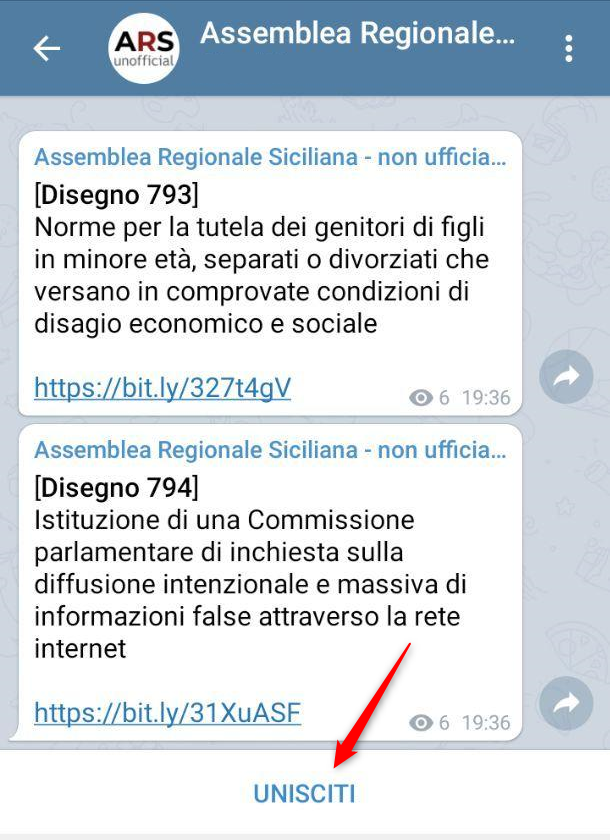

# Seguire i disegni di legge Assemblea regionale siciliana

> L'**Assemblea regionale siciliana** (ARS) dal 1947 è l'**organo legislativo** della **Regione siciliana**, come previsto dal suo statuto speciale. (da Wikipedia)

Il sito (<https://www.ars.sicilia.it/ms/home/cerca/221.jsp>) dedicato ai **disegni di legge** che vengono prensentati in questo contesto ha un ricco motore di ricerca, che supporta anche [modalità ricche di raffinate](https://w3.ars.sicilia.it/home/cerca/help.jsp), ma non ha una modalità che avvisa tutte le volte che **un nuovo disegno** inizia a **prendere vita**.

Allora abbiamo creato un feed RSS, che si aggiornerà tutte le volte che un nuovo disegno verrà pubblicato nel sito. Basterà iscriversi e si verrà avvisati.

L'indirizzo è <http://feeds.feedburner.com/ars_disegni_legge>

## Come iscriversi

Un *feed RSS* è di base un elenco di avvisi. Ci si può iscrivere e **rimanere aggiornati** nei modi descritti sotto.

### Posta elettronica

Questo è il metodo più semplice". Basta aprire [questa pagina](https://feedburner.google.com/fb/a/mailverify?uri=ars_disegni_legge&amp;loc=en_US), 1) inserire il proprio **indirizzo email**, 2) fare click sulla verifica di non essere un robot e 3) poi sul pulsante di iscrizione.

Chi si è iscritto così, riceverà un'email per confermare la cosa.

Una volta iscritti si riceverà un'email periodica, con l'elenco degli ultimi Disegni di Legge presentati (numero del disegno, titolo e link per aprire la pagina dedicata).

### Lettori di feed RSS

L'output principale di questo lavoro è un *feed RSS*, quindi per leggerlo si può usare uno dei lettori dedicati. Una volta installato il *reader*, non rimane che aggiungere l'URL del feed: <http://feeds.feedburner.com/ars_disegni_legge>

Alcuni esempi di lettori di feed RSS, installabili su *smartphon* e/o usabili da PC:

- feedly <https://feedly.com/>;
- Inoreader <https://www.inoreader.com/>;
- Tiny Tiny RSS <https://tt-rss.org/>.

Una volta aggiunto, le varie proposte di Disegno Di Legge appariranno nel proprio lettore (sotto un esempio).

### Canale Telegram

Per chi usa [**Telegram**](https://telegram.org/) è stato creato un canale, dove saranno pubblicate le proposte di Disegno Di Legge che entreranno nel tempo sul sito dell'ARS.

Per iscriversi al canale fare click qui <https://t.me/ars_unofficial> e una volta aperto il canale fare click su <kbd>UNISCITI</kbd>

